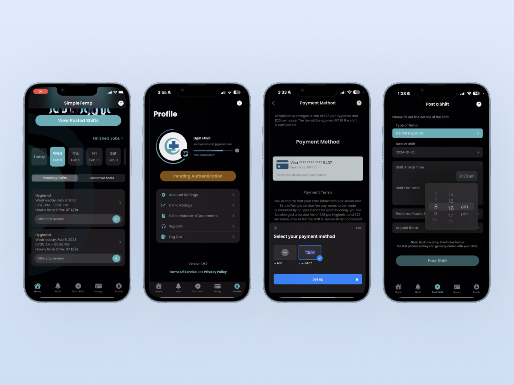

# SimpleTemp Project 🚀

## Project Overview
SimpleTemp is a modern platform for dental clinics, hygienists, and dental nurses in London, UK. This application simplifies the temporary staffing process by directly connecting clinics with professionals in the dental field. I was the **lead developer for iOS, backend, and frontend**, while the **Android version was developed by another team member**. Additionally, I was **the project manager and the main contractor with the client**. 💼

## How It Works 🔄
- **24/7 Access:** Users can book temporary shifts or submit job proposals anytime.
- **Choose the Right Fit:** Clinics can easily review dental professionals’ profiles and select the best candidate.
- **Transparent Pricing:** Registration is free, and a fee is charged only after a shift is completed.
- **Unmatched Flexibility:** Clinics can book temporary staff from weeks in advance to the night before a shift.
- **Real-time Communication & Support:** Clinics and professionals can communicate through instant messaging and notifications.
- **User Verification:** All clinics and professionals must verify their identity for security and quality assurance.
- **Shift & Invoice Management:** Clinics and professionals can view and manage invoices directly from the platform.

## Technologies Used 🛠
| Component | Technology |
|-----------|------------|
| **Backend** | Node.js / Express (MVC Modular) |
| **Database** | PostgreSQL or MongoDB (ORM) |
| **iOS** | Swift / UIKit (MVC Modular) |
| **Admin Dashboard** | React.js / Ant.design (MVVM) |
| **Landing Page** | React.js / HTML / CSS |
| **Android** | Kotlin (MVVM) |
| **Server** | Linux Ubuntu / Nginx (Dockerized) |

## Key Features 🎯
### **For Dental Clinics**
- Sign up and create a profile
- Post job requests for temporary staff
- View and accept offers from professionals
- Manage confirmed shifts
- Process payments via the in-app system
- Receive invoices and manage payments
- Send messages and notifications to temp professionals
- Cancel shifts with prior notice and defined policies

### **For Dental Hygienists & Nurses**
- Sign up and create a profile
- Browse available shifts and submit offers
- Set hourly rates for shifts
- View and manage confirmed shifts
- Receive payments from clinics
- Generate and manage invoices
- Communicate directly with clinics
- View clinic ratings and user feedback

### **Admin Dashboard Features**
- Manage users (clinics and temp professionals)
- Monitor financial transactions
- Analyze financial trends and income reports
- Manage user verification statuses
- Configure service policies and rules

## Download the App 📲
🔹 **Official Website:** [SimpleTemp Website](http://simpletemp.co.uk)

🔹 **Download on Google Play (Available only in the UK 🇬🇧):**  
[SimpleTemp on Google Play](https://play.google.com/store/apps/details?id=com.simpletempco.simpletemp&gl=UK)

🔹 **Download on the App Store (Available only in the UK 🇬🇧):**  
[SimpleTemp on App Store](https://apps.apple.com/gb/app/simpletemp/id1631831946)

## App Screenshots 📸
(The following five placeholders will be replaced with actual screenshots of the app.)

1. 
1. 

## Additional Information ℹ️
- This project was developed **for demo purposes only** and does not require installation instructions.
- Online payments are processed through **Stripe**.
- Users must complete identity verification before using the application (**Clinics via CQC, Professionals via GDC**).
- The UI/UX design follows **Material Design principles** for both iOS and Android.
- User data security is ensured through encryption and two-factor authentication.

---
This document is prepared for **GitHub** to showcase the project's capabilities and technologies used. 🚀

